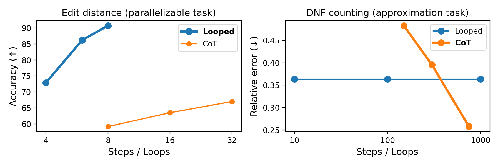

# Chain-of-Thought vs. Latent Thought

This repository provides the official implementation of the experiments in [A Formal Comparison Between Chain-of-Thought and Latent Thought](https://arxiv.org/abs/2505.19245).



## Installation
```shell
conda create --name cotloop
conda activate cotloop
pip install -r requirements.txt
conda activate cotloop
```

## Experiments

### Word Problem

Generate dataset.
```shell
python gen_data/word.py --group=S5 --k=64 --data_dir data/word_problem --samples=1000000
```

Train and evaluate.
```shell
python -m experiments.train --task word --input_size 64 --model GPT --n_layer 2 --is_causal --chain
python -m experiments.train --task word --input_size 64 --model CT --n_layer 2 --n_step 8 --is_causal
python -m experiments.train --task word --input_size 64 --model Looped --n_layer 2 --n_loop 8 --is_causal
```


### Graph Connectivity 

Generate dataset.
```shell
python gen_data/path.py --num_nodes 32 --train_size 1000000 --test_size 100000 --data_dir data/path --seed 42
```

Train and evaluate.
```shell
python -m experiments.train --task word --input_size 64 --model GPT --n_layer 2 --is_causal --chain
python -m experiments.train --task word --input_size 64 --model CT --n_layer 2 --n_step 8 --is_causal
python -m experiments.train --task word --input_size 64 --model Looped --n_layer 2 --n_loop 8 --is_causal
```


### Arithmetic Expression
```shell
python gen_data/strings.py --length 32 --train_size 1000000 --test_size 100000 --data_dir data/ed

# CoT
python -m experiments.train --task ed --input_size 16 --model GPT --n_layer 1 --n_loop 8 --curriculum fixed_length --make_chain
# Loop
python -m experiments.train --task ed --input_size 32 --model TMLT --n_layer 1 --n_loop 8 --curriculum fixed_length
# CT
python -m experiments.train --task ed --input_size 16 --model TMLT --n_layer 1 --n_loop 8 --curriculum fixed_length
```

### Edit Distance
```shell
python gen_data/strings.py --length 32 --train_size 1000000 --test_size 100000 --data_dir data/ed

# CoT
python -m experiments.train --task ed --input_size 16 --model GPT --n_layer 1 --n_loop 8 --curriculum fixed_length --make_chain
# Loop
python -m experiments.train --task ed --input_size 32 --model TMLT --n_layer 1 --n_loop 8 --curriculum fixed_length
# CT
python -m experiments.train --task ed --input_size 16 --model TMLT --n_layer 1 --n_loop 8 --curriculum fixed_length
```

### ProsQA

Get prosqa_train.json , prosqa_test.json, prosqa_valid.json from [Coconut](https://github.com/facebookresearch/coconut) and place on ./data

```shell
python -m experiments.train --task ProsQA --input_size 16 --model GPT --n_layer 1 --chain # CoT
python -m experiments.train --task ProsQA --input_size 16 --model CT --n_layer 1 --n_step 8 --chain # CT
python -m experiments.train --task ProsQA --input_size 32 --model TMLT --n_layer 1 --n_loop 8 # Loop
```

###  Approximate Counting and Sampling

### DNF counting


Generate dataset.
```shell
python gen_data/dnf.py
```

Train and evaluate.
```shell
python -m experiments.train_dnf --model GPT --chain --steps_per_epoch 10000 --num_mc_samples 1000
python -m experiments.train_dnf --model CT/Looped --epoch 10 --n_step/n_loop 100
```


### Graph coloring (sampling)

Train and evaluate.
```shell
python -m experiments.train_dnf --model GPT --chain --steps_per_epoch 10000 --num_mc_samples 1000
python -m experiments.train_dnf --model CT/Looped --epoch 10 --n_step/n_loop 100
```


## Acknowledgement
- [Leveraging Neural Networks for Approximate DNF Counting (AAAI 2020)](https://github.com/ralphabb/NeuralDNF)
- [Neural Networks and the Chomsky Hierarchy (ICLR 2023)](https://github.com/google-deepmind/neural_networks_chomsky_hierarchy/tree/main)
- [Towards Revealing the Mystery behind Chain of Thought: a Theoretical Perspective (NeurIPS 2023)](https://github.com/guyuntian/CoT_benchmark)
- [Why think step by step? Reasoning emerges from the locality of experience (NeurIPS 2023)](https://github.com/benpry/why-think-step-by-step)
- [The Illusion of State in State-Space Models (ICML 2024)](https://github.com/jopetty/word-problem)
- [Coconut: Training Large Language Models to Reason in a Continuous Latent Space (COLM 2025)](https://github.com/facebookresearch/coconut)
- [From Explicit CoT to Implicit CoT: Learning to Internalize CoT Step by Step (2024)](https://github.com/da03/Internalize_CoT_Step_by_Step)